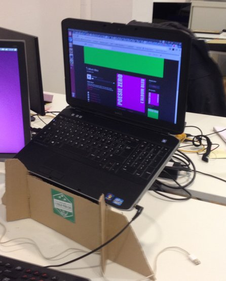
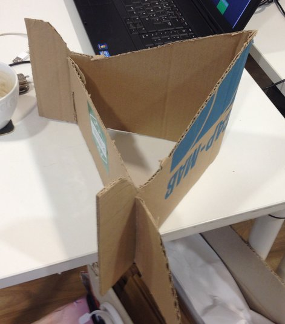
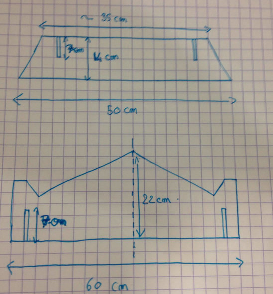
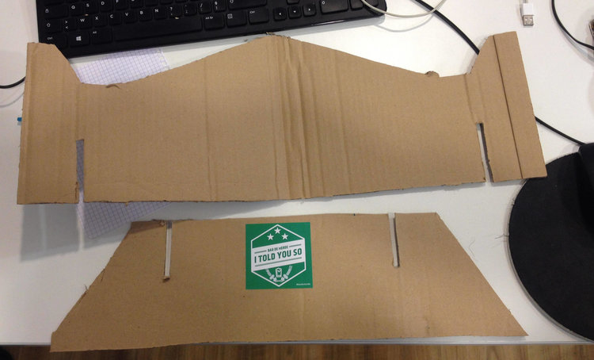

On conseil souvent aux personnes passant beaucoup de temps devant un ordinateur de placer l'écran à la hauteur de leurs yeux.

Jusque là chez Evaneos certains avaient une petite astuce pour sur-élever leurs ordinateurs portables. Ils allaient piocher dans notre réserve de livres pour en sortir quelques pépites :

- Adobe Flex
- CCS 2
- Drupal 6
- Le Guide du Routard en Corée du Nord

Bref, des bouquins sans beaucoup d'intérêt.

Et puis soudain à l'occasion de notre déménagement beaucoup de cartons se sont accumulés. Nous avons donc décidé d'en récupérer une partie pour fabriquer des laptop stands avec.

Comme on est sympas on vous donne même un croquis des pièces à découper une photo pour que vous puissiez faire le votre vous même.

Rien de bien compliqué !

